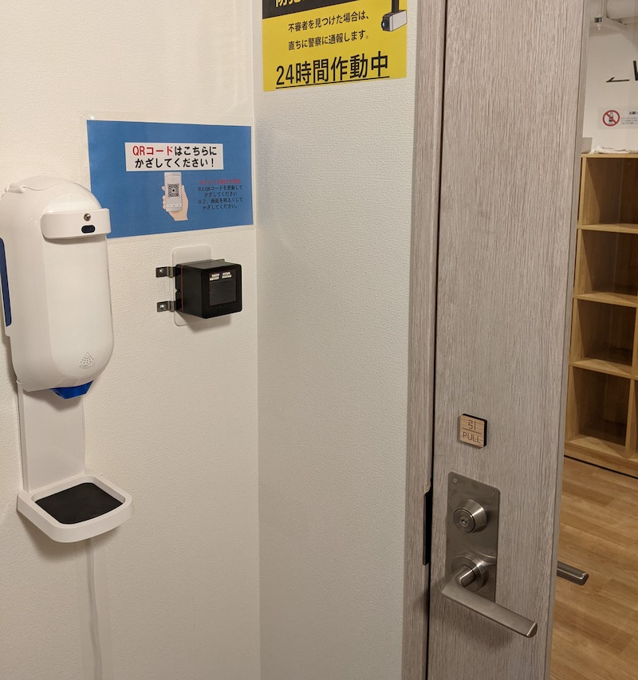

Today I went to a fitness gym open 2 days ago. The reason why I started exercising today is I will start full remote work within 2 months. I feel my ability to concentrate is slightly reduced according to my age. I think plenty of exercises might make it better.

## Fitness Gym

The gym tracks members' entry by their mobile app and QR code. They said they as a gym are fully automated and they don't have any staff. Instead, they are relationally cheap. It costs about just 30 USD per month.

I'm surprised that there are no people in the gym when I arrived there. It seems they are not so popular for now.

And I didn't know how to use the machines in the gym. Their app has some youtube video tutorials.

I tried an aero bike for 30min. I felt strange that I pedal a bike alone in the gym silently. There are "AI" (they said so) powered cameras to monitor the member's activity. I felt an SF flavor here. I think it'll be perfect if they produce electric power from my bike to drive the gym.

I'm interested in their security - their locker is fully open and there's no lock. Of course, their entrance is locked and kept secure with QR-based authentification. They don't prevent theft but they can track their members and they have records of members' activities. It's easy to sue thieves after problems happen. I think services that have a similar kind of security policy are increasing recently.

## Draw the same thing every single day

While I was doing the exercise, I watched the youtube video.

[The drawing advice that changed my life](https://www.youtube.com/watch?v=M6NsEDwHHiE)

They said, "Draw the same thing every single day" is a good habit to keep focused and take action before thinking. Yeah of course I can do that in "Draw the same Deno every single day" here.

I feel my English vocabulary is not enough to understand the video, I'm not good at understanding relaxed speaking.

## Today's ESL question

[Disabilities](https://www.eslconversationquestions.com/disabilities/)

> How does the government in your country help disabled people?

Public transport affiliates are helps disabled people in any way. But for websites, they are not so helpful accessibility.

> What are some common disabilities?

Color blindness, auditory disturbance, wheelchair users, etc. I sometimes feel auditory disturbance a little.

> How are disabilities viewed in your country?

Some people express disabled people as "pity". It's not a good way to treat them.

> What kinds of disabilities do people develop as they grow older?

Auditory disturbance, presbyopic eye, etc.

> Do you know a person with a disability?

My friend has color blind.

> What did you learn in today’s class about people with disabilities?

Oh, this material is for teachers haha.

> How can our world become more inclusive and equal for people with disabilities?

Keep informed about disability. We, web developers, can study accessibility and improve linters.

> Have you seen people with disabilities be excluded, judged, or not experience accessibility?

I have not seen it recently, but I think it's only because my perspective is narrow. There are a lot of websites that are not accessible.

> How do we stop the idea that people with disabilities should be pitied and instead see them as equals?

I don't know... But I think education will help.

> Why do you think people with disabilities have experienced discrimination and abuse, both in the past and still today?

Because our information for disability is not enough.

> Why did it take so long for governments to make laws giving rights to people with disabilities?

They are always slow to change laws because they don't like to change customs.

--- 

88 min to write
