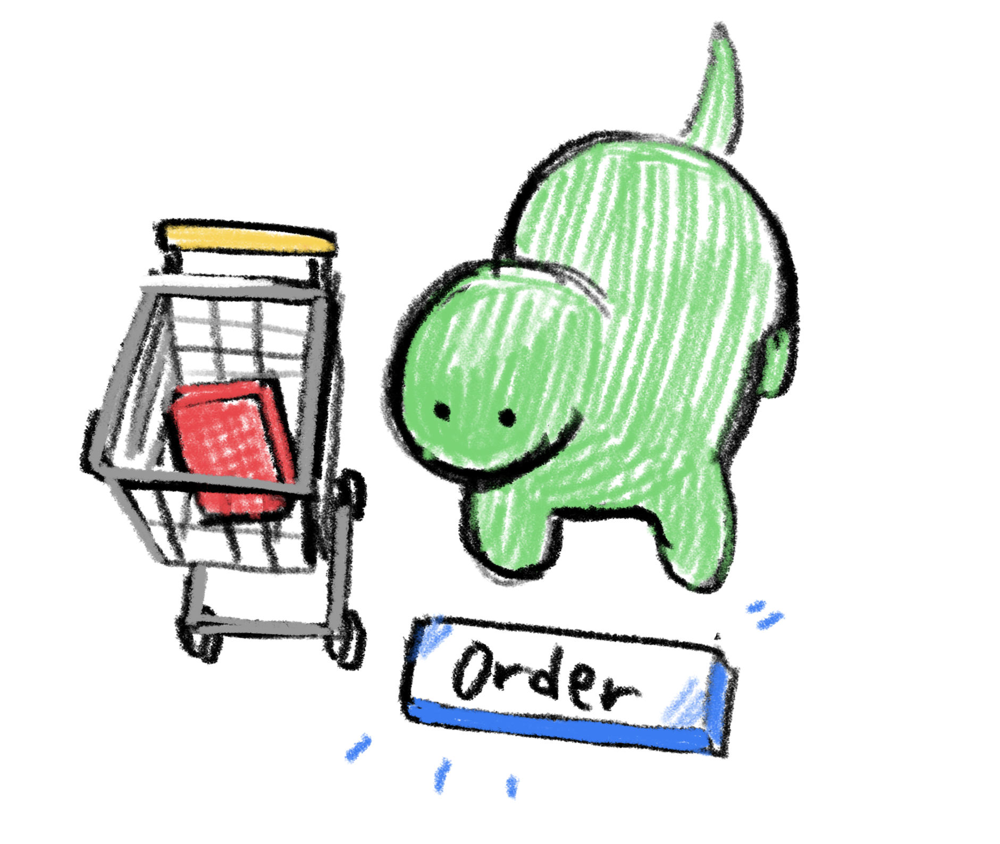

Today I met my friend who has his company and works hard in an OSS community to manage the meetup.
I met him to get advice about my design and work style as a freelancer.

At that time, I was hesitant to buy my Adobe CC license. My friend is an Adobe products expert, so I asked him to give me that push.

He said it's impossible to "print" clothes without Adobe products. So I finally bought the license.

I decided to buy the license in my budget because I'll use it anywhere. Mainly I'm interested in After Effects.

Later we had dinner together, and he told me he would support OSS meetups with his company.
He is also thinking about get some profit from helping tech companies meetups.
I like meetups, and I'm not satisfied I couldn't attend them in the COVID 19 situation.

I’m sure his attempts will be successful and positively affect the tech community.